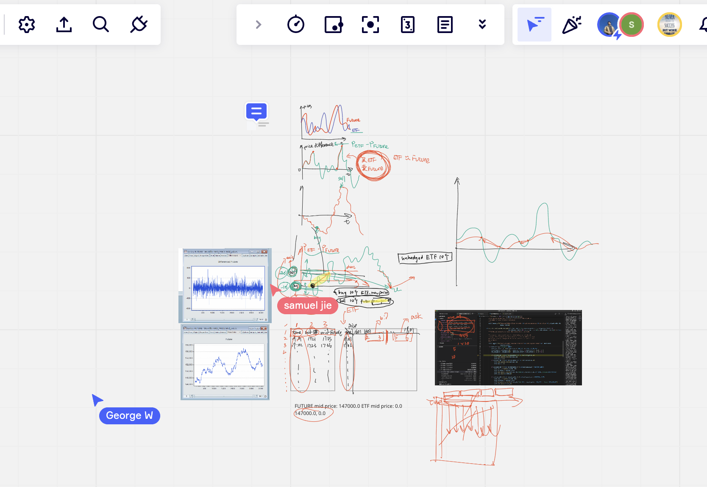
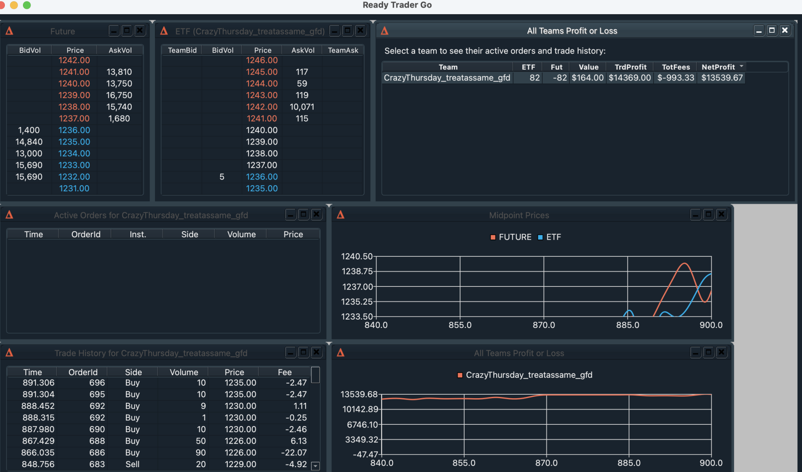

# Optiver_Go
Our implementation C and py of Optiver Go 2023.

See also https://github.com/Haoran-Jie/ReadyTraderGo_CrazyThursday

## IT'S READY TRADER GO TIME

Welcome to the ultimate team student trading competition. Competitors get to
learn all the fundamentals of trading and truly test their coding and analytical
skills. The aim is to build and optimise a trading algorithm that outperforms
all others on a virtual exchange.

To learn more about the competition, visit [readytradergo.optiver.com]
(https://readytradergo.optiver.com).

## Memory

